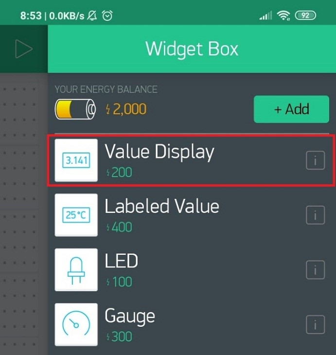

# IoT Project Blynk Incoming Object Counter base on NodeMCU ESP8266

## Description:

- The FC-51 infrared sensor module is a sensor that works to detect obstacles in front of the sensor module. The FC-51 infrared sensor module has two main parts consisting of an IR transmitter and an IR receiver. The function of the IR transmitter is the part that is tasked with emitting infrared radiation to an object or obstacle. While the IR receiver is the part that functions to detect radiation that has been reflected by an object that comes from the IR transmitter. If the FC-51 Sensor is connected to an IoT device, the data obtained can be processed and displayed anywhere.

## Schematic:


## Component (Tools & Materials):

• NodeMCU ESP8266 : 1 unit; <br>
• Breadboard : 1 unit; <br>
• Pushbutton : 1 unit; <br>
• LED : 1 unit; <br>
• Resistor 220Ω : 1 unit; <br>
• Sensor infrared FC-51 : 1 unit. <br>

## Sketch Program

```cpp
#define BLYNK_PRINT Serial
#include &amp;lt;ESP8266WiFi.h&amp;gt;
#include &amp;lt;BlynkSimpleEsp8266.h&amp;gt;

char auth[] = "XXXX";       // masukkan kode autentikasi disini
char ssid[] = "Veendy-Suseno";    //nama wifi
char pass[] = "Admin1234";  //password

const int tDelay = 500;
int ledPin = 12;
int inputPin = 13;
int resPin = 14;
int counter = 0;
int val;
int res;
int lastval;

void setup(){
    pinMode(ledPin, OUTPUT);
    pinMode(resPin, INPUT_PULLUP);
    pinMode(inputPin, INPUT);
    Serial.begin(9600);
    Blynk.begin(auth, ssid, pass);
}

void loop(){
    val = digitalRead(inputPin);
    res = digitalRead(resPin);
    if (val != lastval) {
        if (val == HIGH) {  //Apabila ada benda masuk
        counter++;
        digitalWrite(ledPin, LOW);
        Blynk.virtualWrite(V5, counter);
        delay(tDelay);
        }
    }
    if (res == LOW) {  //Apabila tombol reset ditekan
        counter = 0;
        Blynk.virtualWrite(V5, counter);
        delay(tDelay);
    }
    else {
        digitalWrite(ledPin, HIGH);
    }
    lastval = val;
    Blynk.run();
}

```

## Blynk Settings:

- Use the Value Display type Widget Box. <br/>
  <br/>
  Widget Box Value Display selection image <br/>

- In Value Display Settings, select Virtual V5 pin.
  <br/>
  Setting Value Display Image.<br/>

## Interface:

<br/>
BLYNK Incoming Goods Counter interface image<br/>

## Conclusion:

- This project is an automatic incoming goods counter using the FC-51 infrared distance sensor and the results will be sent to the blynk application and to be displayed on the numeric indicator. This tool is also equipped with a reset button.
